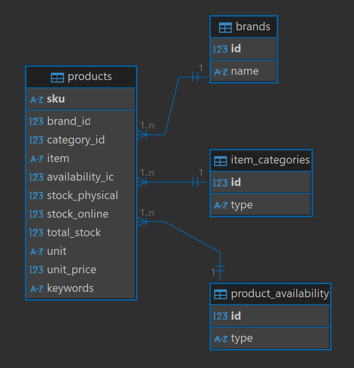
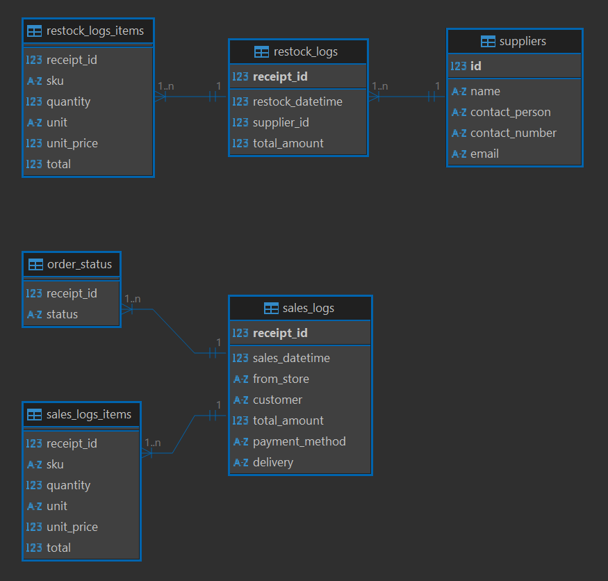

# Construction Hardware Database 

A personal project about developing a proposed database system for a construction hardware store.

## Overview

RC Trading is a construction hardware store based on the Philippines known for selling high-end construction materials at an affordable price. Currently they have two physical branches located in Quezon City (main branch) and Valenzuela City. This year, 2025, one of their business goals is to scale up their operation. They want to try engaging into e-commerce by setting up an online store where they start small by selling only a few in-demand products. In order to have a proper system to manage and monitor all business operations knowing they also need to keep track of activities in their online store, they reached out a business consulting agency and were recommended to develop a database system with a proper frontend for interaction.

## Scope

The database for RC Trading includes all entities necessary to facilitate the process of tracking product inventory, monitoring orders in both physical and online stores, and documenting sales and restocking of products. More specifically, the following are included in the scope of the database's design:

1. Products, including information such as stock keeping unit (SKU), available stock in physical and online store, and retail price.
2. Item categories for products. The hardware currently has the following categories for their products:
    + Building Materials
    + Plumbing
    + Electrical
    + Painting
    + Hardware
    + Tools
3. Brand names of products.
4. Logs for both sales and restock.
5. Supplier information for restock.
6. Order status to monitor all orders from physical and online store.

Since the database lies on the backend and most of the employees would use the frontend for viewing, searching, and inserting records for orders or revisions, the user management system is beyond the scope of the design. Furthermore, the currency used is limited to the local currency - Philippine Peso (PHP).

SQLite is used to develop the database for simplicity and quick deployment.

## Functional Requirements

The database will support the following:
1. CRUD operations for the business owners and employees
2. Tracking inventory of all products and orders from physical and online store.
3. Record sales and restocks made.

## Representation 

Entities are captured in SQLite tables with the following schema.

### Entities

The database includes the following entities:

#### Products

The `products` table includes:

+ `sku` - *Primary key* that specifies the unique stock keeping unit (SKU) of the product in the store
+ `brand_id` - *Foreign key* referencing the integer ID of the brand name of the product from the `brands` table.
+ `category_id` - *Foreign key* referencing the integer ID of the item category type of the product from the `item_categories` table.
+ `availability_id` - *Foreign key* referencing the integer ID of the platform where the product is available for sale from the `product_availability` table.
+ `item` - Given title/name of the product listing
+ `stock_physical` - Allocated stock to sell at the physical store with a default value of zero.
+ `stock_online` - Allocated stock to sell at the online store with a default value of zero.
+ `total_stock` - Total stock the store has for the product which is the sum of `stock_physical` and `stock_online`. This is automatically generated using the *GENERATED ALWAYS* clause. 
+ `unit` - Reference unit used for the product (e.g. sq.m for per square meter, m for per meter length, kg for per kilogram, pcs for pieces)
+ `unit_price` - Price per unit quantity of the product.
+ `keywords` - Reference text used for searching the product. Useful when looking for a product but cannot provide more specific information about it.

#### Brands

The `brands` table includes:

+ `id` - *Primary key* integer assigned to a brand name in a product. It automatically increments when adding a new brand in the record.
+ `name` - Name of the brand in a product (e.g 'Bosch'). The text is set as case-insensitive using *COLLATE NOCASE* for checking purposes.

#### Item Categories

The `item_categories` table includes:

+ `id` - *Primary key* integer assigned to a category type of a product.
+ `type` - Category type of a product. The text is set as case-insensitive using *COLLATE NOCASE* for checking purposes. The following text were assigned for each of the current categories of the products:
    + 'bldg_materials' - Building Materials
    + 'plumbing' - Plumbing
    + 'electrical' - Electrical
    + 'painting' - Painting
    + 'hardware' - Hardware
    + 'tools' - Tools

#### Product Availability

The `product_availability` table includes:

+ `id` - *Primary key* integer assigned to a (platform) availability type of a product.
+ `type` - (Platform) availability type of a product. The text is set as case-insensitive using *COLLATE NOCASE* for checking purposes. The following are the possible types of a product:
    + 'physical' - Available at the physical store only.
    + 'online' - Available at the online store only.
    + 'physical and online' - Available in both physical and online stores.

#### Sales Logs

The `sales_logs` table includes:

+ `receipt_id` - *Primary key* integer assigned to a sale transaction. It automatically increments when adding a new transaction in the record.
+ `sales_datetime` - Date and time the sale was made. Default is the current timestamp.
+ `from_store` - Refers to what platform the sale was made, which is either in the *physical store* 'physical' or *online store* 'online' but not both.
+ `customer` - Name of the customer. Default is NULL.
+ `total_amount` - Total amount of sale in the transaction. This is updated based on the items involved in a transaction using a defined trigger.
+ `payment_method` - Payment method used by the customer. Currently the store offers the following payment methods:
    + 'cash' - Cash
    + 'e-wallet' - Online payments from services like GCash and Maya
    + 'bank transfer' - Bank transfer
    + 'check' - Bank check
    + 'credit' - Credit card
+ `delivery` - Delivery method for the sale, which is either by *pickup* 'pickup' or by *shipping* 'ship'. 

#### Sales Logs Items

The `sales_logs_items` table includes:

+ `receipt_id` - *Foreign key* referencing the integer ID of the sale transaction from the `sales_logs` table.
+ `sku` - SKU of the item sold based on the listing in the `products` table.
+ `quantity` - Quantity of the product bought by the customer.
+ `unit` - Reference unit used for the product.
+ `unit_price` - Price per unit quantity of the product during the time of transaction.
+ `total` - Total amount of purchase for the particular item automatically computed as the product of `quantity` and `unit_price` using the *GENERATED ALWAYS* clause. 

#### Order Status

The `order_status` table includes:
+ `receipt_id` - *Foreign key* referencing the integer ID of the sale transaction from the `sales_logs` table.
+ `status` - Status of the order. The following are the possible status of an order associated to a sale.
    + 'ongoing' - (Default) The order is currently processed.
    + 'shipping' - The order is being shipped out.
    + 'completed' - The order is completed, applicable for cases where the product sold are delivered or picked up.

#### Restock Logs

The `restock_logs` table includes:

+ `receipt_id` - *Primary key* integer assigned to a restock transaction. It automatically increments when adding a new transaction in the record.
+ `restock_datetime` - Date and time the restocking of a product was made. Default is the current timestamp.
+ `supplier_id` - *Foreign key* integer referencing the integer ID of the supplier of the restocked product from the `suppliers` table.
+ `total_amount` - Total amount of restock purchase in the transaction. This is updated based on the items involved in a transaction using a defined trigger.

#### Restock Logs Items

The `restock_logs_items` table includes:

+ `receipt_id` - *Foreign key* referencing the integer ID of the restock transaction from the `restock_logs` table.
+ `sku` - SKU of the restocked item based on the listing in the `products` table.
+ `quantity` - Quantity of the product bought from the supplier. 
+ `unit` - Reference unit used for the product.
+ `unit_price` - Price per unit quantity of the product during the time of transaction. Note that this is usually smaller than the retail price.
+ `total` - Total amount of purchase for the particular item automatically computed as the product of `quantity` and `unit_price` using the *GENERATED ALWAYS* clause. 

#### Suppliers

The `suppliers` table includes:

+ `id` - *Primary key* integer assigned to a supplier the store has transacted with for restocking. It automatically increments when adding a new supplier in the record.
+ `name` - Company name of the supplier.
+ `contact_person` - A person in the company the store can reach out when buying items for restock.
+ `contact_number` - Contact number of the supplier.
+ `email` - Business email of the supplier.

#### Triggers for automation

Triggers are defined in the schema of the database when adding, updating, and deleting records of sales in `sales_logs` and `sales_logs_items`, and restocks in `restock_logs` and `restock_logs_items`. These triggers essentially update the `total_amount` for every items involved in a transaction.

#### Indexes for optimization

Indexes are defined as follows to optimize the performance of common queries.
+ `item_search` - Index on `products` for columns `item` and `keywords`
+ `sold_items_search` - Index on `sales_logs_items` for columns `receipt_id` and `sku`
+ `restock_items_search` - Index on `restock_logs_items` for columns `receipt_id` and `sku`

### Relationships

The below entity relationship diagram describes the relationships among the entities in the database.

A product listed in `products` is associated to a brand listed in `brands`, a category type in `items_category` and availability type in `product_availability`. An example is shown below:

    products.item = 'Belden PPR PN20 25mm x 10ft'
    brands.name = 'Belden'
    items_category.type = 'plumbing'
    product_availability.type = 'physical'

Generally the `brands`, `items_category`, and `product_availability` tables exhibit a **one-to-many relationship** with the `products` table.

+ A sale transaction recorded in `sales_logs` may be associated to multiple records in `sales_logs_items` since its often the case a transaction involves different kinds of items ordered by a customer. Then a record in `order_status` exist for every sale transaction.

+ A restock transaction recorded in `restock_logs` may be associated to multiple records in `restock_logs_items` since its possible more than one items are bought for restocking in a single transaction. Then for every transaction involves a supplier from the `suppliers` table. 
